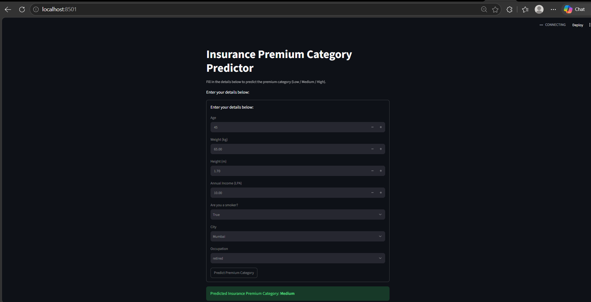
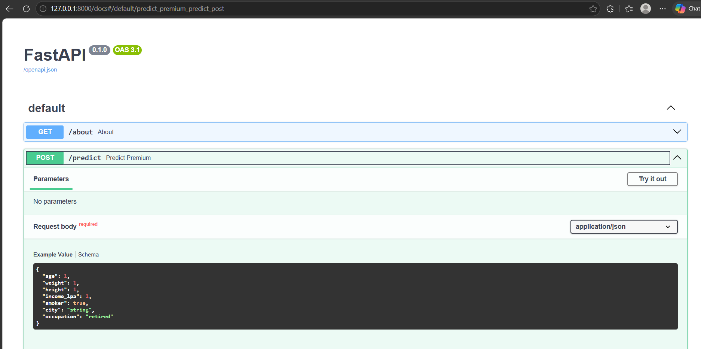

# 💰 Insurance Premium Predictor

An end-to-end machine learning system that predicts a user's **insurance premium category** (Low / Medium / High) from health, lifestyle, and demographic data — built with a scikit-learn classification pipeline, served through a **FastAPI** backend, and consumed via a **Streamlit** frontend.

---

## 🚀 Features

- **ML-powered predictions** — a Random Forest classifier trained on engineered health & lifestyle features
- **REST API** built with FastAPI, with automatic request validation via Pydantic
- **Interactive UI** built with Streamlit for a no-code way to get predictions
- **Feature engineering pipeline** (BMI, age group, lifestyle risk, city tier) shared between training and serving, so predictions stay consistent
- **Auto-generated API docs** via FastAPI's built-in Swagger UI (`/docs`)

---

## 🏗️ Architecture

```
User Input (Streamlit UI)
        │
        ▼
FastAPI /predict endpoint  ──►  Pydantic validation
        │
        ▼
Feature Engineering (bmi, age_group, lifestyle_risk, city_tier)
        │
        ▼
Trained scikit-learn Pipeline (model.pkl)
        │
        ▼
Predicted Premium Category (Low / Medium / High)
```

---

## 🛠️ Tech Stack

| Layer            | Technology                     |
|-------------------|---------------------------------|
| Frontend          | Streamlit                      |
| Backend API       | FastAPI                        |
| Validation        | Pydantic                       |
| ML Model          | scikit-learn (Random Forest)   |
| Data Handling     | pandas, numpy                  |
| Serialization     | pickle                         |

---

## 📁 Project Structure

```
│
├── app.py                           # FastAPI backend with /predict endpoint
├── frontend.py                      # Streamlit UI that calls the API
├── model.pkl                        # Trained scikit-learn pipeline
├──MLModel\feature_engineering.py    # Shared feature engineering logic
├──MLModel\train_model.py            # Model training script
├──MLModel\generate_data.py          # Synthetic data generation (for demo purposes)
├──MLModel\test_model.py             # Sanity-check script for model predictions
├── requirements.txt
└── README.md
```

---

## ⚙️ Setup & Installation

1. **Clone the repository**
   ```bash
   git clone https://github.com/<your-username>/insurance-premium-predictor.git
   cd insurance-premium-predictor
   ```

2. **Create and activate a virtual environment**
   ```bash
   python -m venv venv
   venv\Scripts\activate      # Windows
   source venv/bin/activate   # macOS/Linux
   ```

3. **Install dependencies**
   ```bash
   pip install -r requirements.txt
   ```

---

## ▶️ Running the Project

**1. Start the FastAPI backend**
```bash
uvicorn app:app --reload
```
API will be live at `http://127.0.0.1:8000`
Interactive docs available at `http://127.0.0.1:8000/docs`

**2. Start the Streamlit frontend** (in a separate terminal)
```bash
streamlit run frontend.py
```
UI will be live at `http://localhost:8501`

---

## 📡 API Usage
**Endpoint:** `POST /about`
**Endpoint:** `POST /predict`

**Request body:**
```json
{
  "age": 35,
  "weight": 90,
  "height": 1.7,
  "income_lpa": 10,
  "smoker": true,
  "city": "Gurgaon",
  "occupation": "government_job"
}
```

**Response:**
```json
{
  "prediction_category": "High"
}
```


---

## 🧠 Model Details

### Raw Inputs

The user (via the API or Streamlit form) provides 7 raw fields:

| Field         | Type   | Description                                                                 |
|----------------|--------|-------------------------------------------------------------------------------|
| `age`          | int    | Age in years                                                                  |
| `weight`       | float  | Weight in kg                                                                  |
| `height`       | float  | Height in meters                                                              |
| `income_lpa`   | float  | Income in lakhs per annum                                                     |
| `smoker`       | bool   | Smoker or not                                                                 |
| `city`         | string | City name                                                                     |
| `occupation`   | string | One of 7 categories: `retired`, `unemployed`, `business_owner`, `government_job`, `private_job`, `freelancer`, `student` |

### Feature Engineering

The model is **never trained on the raw fields directly** — the 7 raw inputs are transformed into 6 engineered features (see `feature_engineering.py`), and it's these derived features the model actually learns from:

| Engineered Feature | Derived From      | Logic                                                              |
|----------------------|--------------------|---------------------------------------------------------------------|
| `bmi`                | `weight`, `height` | `weight / height²`                                                  |
| `age_group`           | `age`              | `young` (<25) / `adult` (<45) / `middle_aged` (<60) / `senior` (60+) |
| `lifestyle_risk`      | `smoker`, `bmi`    | `high` (smoker + bmi>30) / `medium` (smoker OR bmi>27) / `low`      |
| `city_tier`           | `city`             | `1` (major metro) / `2` (mid-size city) / `3` (everything else)     |
| `income_lpa`          | passed through unchanged | —                                                              |
| `occupation`          | passed through unchanged | —                                                              |

Keeping this logic in a single shared module (`feature_engineering.py`), imported by both `train_model.py` and `app.py`, ensures the API always transforms input the exact same way the model was trained — avoiding train/serve skew.

### Algorithm

**Random Forest Classifier** (scikit-learn), wrapped in a `Pipeline` with a `ColumnTransformer` that one-hot encodes the categorical features (`age_group`, `lifestyle_risk`, `occupation`) while passing numeric features (`bmi`, `income_lpa`, `city_tier`) straight through. The final pipeline (preprocessing + model) is serialized as a single `model.pkl`, so the API only needs to call `.predict()` on the engineered feature DataFrame — no separate encoder to manage.

> **Note:** This project uses synthetically generated training data for demonstration purposes and is not trained on real insurance underwriting data. It's built to showcase the full ML deployment pipeline (feature engineering → training → API → UI), not to be used for actual insurance decisions.

---

## 📸 Screenshots

_screenshots of the Streamlit UI and Swagger docs here._



---

## 🔮 Future Improvements

- Train on real-world insurance data
- Add authentication to the API
- Deploy to a cloud platform (Render, Railway, or AWS)
- Add model versioning and experiment tracking (e.g. MLflow)
- Dockerize the full stack for easier deployment

---

## 🙋 Author

Built by **Sachin.S** as part of a hands-on Generative AI / ML learning project.

- GitHub:https://github.com/sachinShettys90
- LinkedIn:https://www.linkedin.com/in/sachin-shetty-5b476723b/